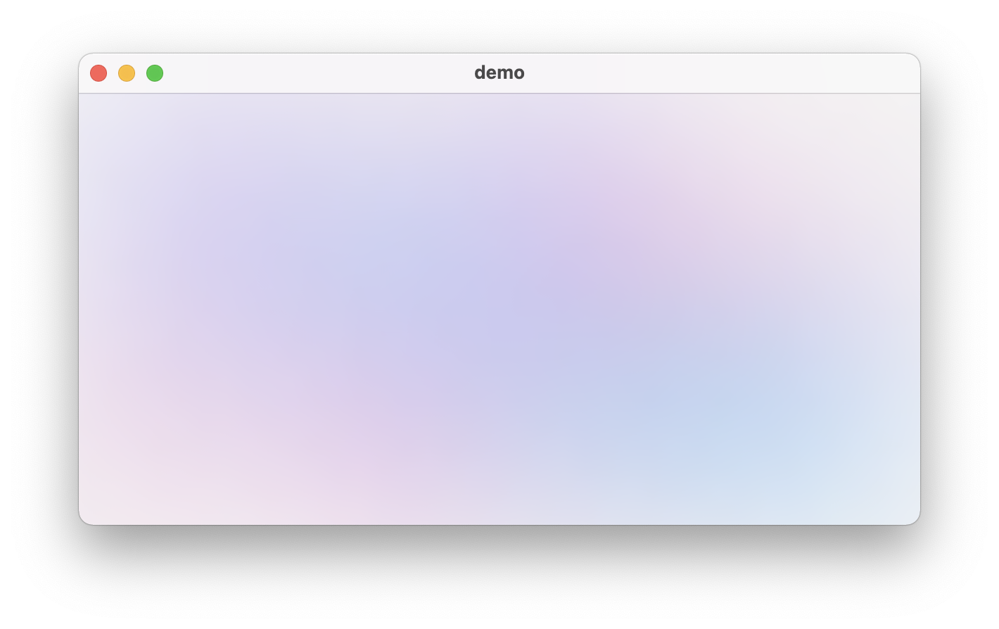

# Colorful

A SwiftUI implementation of AppleCard's animated colorful blur background.

For improved version with Metal, see [ColorfulX](https://github.com/Lakr233/ColorfulX).

## Preview



## Usage

```swift
import Colorful

var body: some View {
    ColorfulView()
}
```

## Customization & Defaults

```swift
init(
    animated: Bool = defaultAnimated,
    animation: Animation = defaultAnimation,
    blurRadius: CGFloat = defaultBlurRadius,
    colors: [Color] = defaultColorList,
    colorCount: Int = defaultColorCount
)
```

## License

Colorful is licensed under [MIT](./LICENSE).

---

Copyright © 2021 Lakr Aream. All Rights Reserved.
